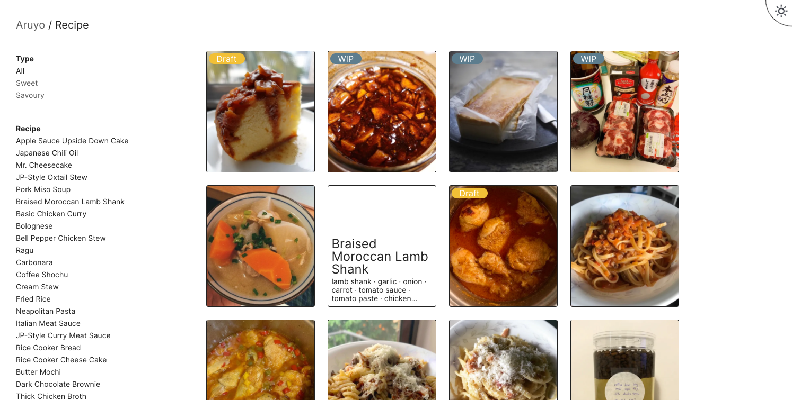

<h1 align="center">
  Aruyo 🍛
</h1>

This is a blog for all kinds of recipe.



## 🚀 Quick Start

Navigate into your new site’s directory and start it up.

```
npm install
npm start
```

Your site is now running at `http://localhost:3000`!

## ✏️ Add new recipe

Navigate into your new site’s directory and type the following command in terminal

```shell
npm run generate
```

And then answer the question the generate the file

```shell
? Recipe Name: Chicken Cream Stew
? Slug: chicken-cream-stew
? Serving: 4
? Serving Size: plate
? Recipe Type: savoury
```

When defining ingredients of the recipe, you can group ingredients like this, if the no grouping required, simply keep `group` as `''`.

```markdown
---
ingredient:
[
    {
      'group': 'For Pudding',
      'ingredient':
        [
          '3        ..... large egg',
          '200-ml   ..... milk',
          '150-ml   ..... heavy cream',
          '60-g     ..... sugar',
          '1-dash   ..... vanila extract',
        ],
    },
    { 
      'group': 'For Caramel',
      'ingredient':
        [
          '70-g     ..... sugar',
          '3-tbsp   ..... water',
        ],
    },
  ]
---
```
